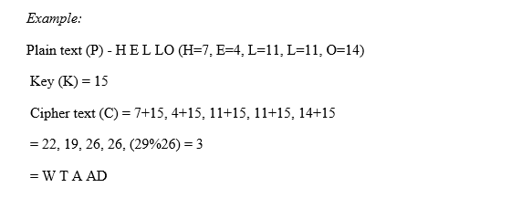
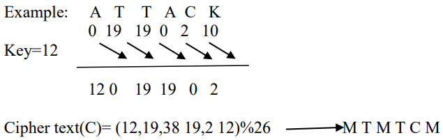
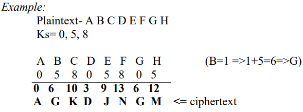

# CryptographyMetods

This is a simple web application built with Django that allows users to encrypt and decrypt text using various encryption methods.

## Encryption Methods: 

 - ### Monoalphabetic Cipher
The monoalphabetic cipher is a substitution cipher where each letter in the plaintext is replaced with a different letter in the ciphertext. The key for this cipher is a mapping of each letter in the alphabet to a different letter in the alphabet. For example, the key might be "A=B, B=C, C=D, ..., Y=Z, Z=A". To encrypt a message, each letter in the plaintext is replaced with the corresponding letter in the key. To decrypt a message, the process is reversed.

 - ### Autokey Cipher

In this cipher, the key is a stream of subkeys, where each subkey is used to encrypt the corresponding character of the plaintext. The first subkey is predefined, and the second subkey is the value of the first character of the plaintext, the third subkey is the value of the second character of the plaintext, and so on.

 - ### Vigenere Cipher
In this cipher, the key stream is the repetition of the initial secret key stream of length m (1 <= m <= 26). Each character of the plaintext is encrypted using the corresponding character of the key stream.

